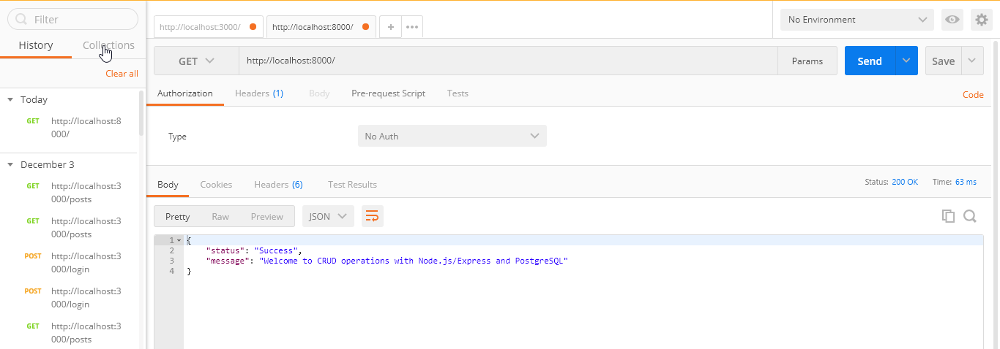
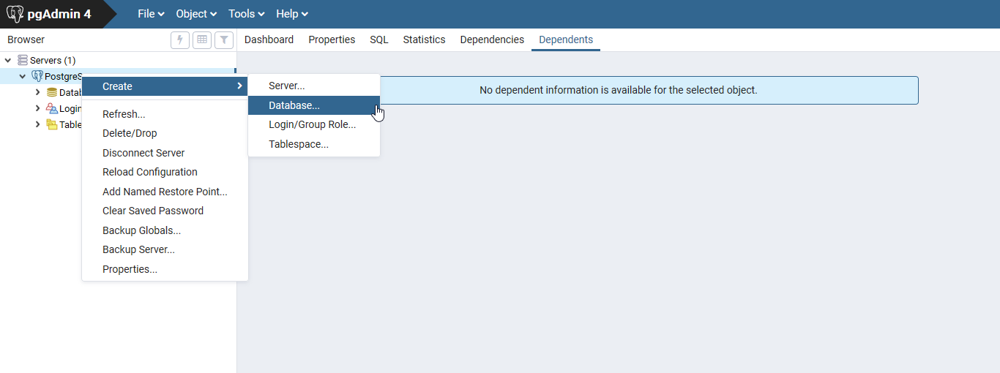
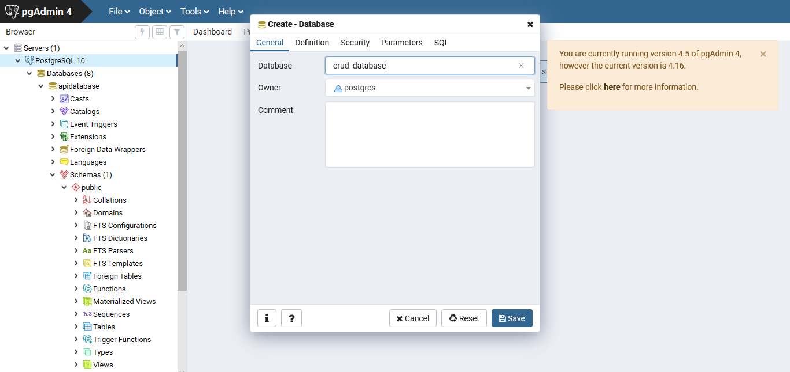
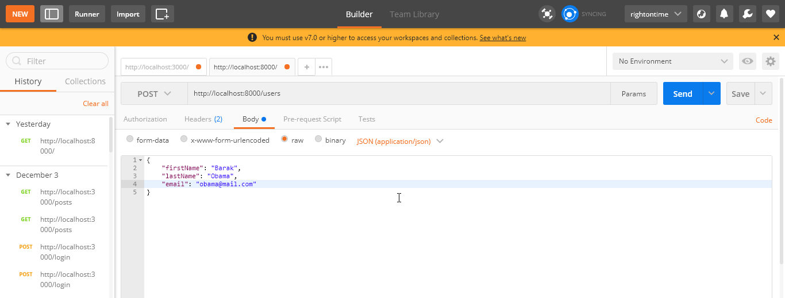
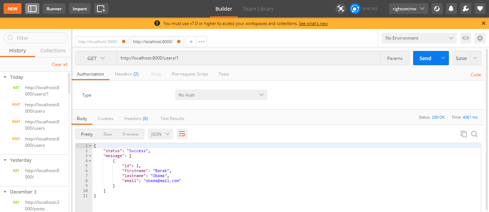

# CRUD operations with Node/Express and PostgreSQL


In this tutorial article, I will be sharing an insight on how to `CREATE`, `READ`, `UPDATE`, and `DELETE` data on a node.js and PostgreSQL back-end. Before we get anything started, you need to ensure you have Node installed on your system. Node.js® is a JavaScript runtime built on Chrome's V8 JavaScript engine.

### Install Node

Visit the [Node.js official website](https://nodejs.org/en/) and download a Long Term Support version for your operating system. 

### Initialize the Project

Create a new directory and give it a name. Let's say...`crud-with-postgres-backend`.
From your terminal or command line, navigate inside the directory you just created and run **npm init** to initialize your project.

```
$ npm init
```
Accept all the defaults including `Is this OK? (yes)`. After that, you will notice a `package.json` file in the root of your directory.

### Set up a Server

Create a new file in the root of your project directory and call it `index.js`. You may name it anything as long as it corresponds with what you have in `package.json`.

Install Express
```
$ npm install express --save
```

Add the following constants to `index.js` file

```javascript
// index.js

const express = require('express')
const app = express()
const bodyParser = require('body-parser')
const port = 8000;

```
We have required **express** from our modules and assigned it to the `app` constant. The required **body-parser** is a middleware that is buit into **express** 4.16 and higher versions. There is no need to install the body-parser's depenedency after all. Then, the last constant is the port number on which the server should run.

Once again, the **body-parser** is a middleware that parses all incoming http body requests before handing them over to your controllers. Click [here](https://expressjs.com/en/resources/middleware/body-parser.html) to learn more about the **express body-parser**.

Now add to your `index.js` a generic JSON and URL-encoded parser as a top-level middleware. It is responsible for parsing all incoming request bodies. 

```javascript
// index.js

app.use(bodyParser.urlencoded({ extended: false }))
app.use(bodyParser.json())

```
One important thing we have to do is make a GET request to the root endpoint/URL of our server. This request should test if the app is working well or not.

```javascript
// index.js

app.get('/', (request, response) => {
    response.status(200).json({
        status: "Success",
        message: "Welcome to CRUD with Node.js/Express and PostgreSQL"
    })
})

```
Call **express** in the app constant to listen for server requests on port 8000.

```javascript
// index.js

app.listen(port, () => {
    console.log(`Application is started and running on port ${port}.`)
})

```
Test the code you have written so far by running the following code on your terminal:

```
$ node index.js
```
If there are no errors in your code, the console will log out... _`Application is started and running on port 8000.`_ Yay!!!

### Make a GET request with Postman

If you do not already have the Postman application, you can visit the [official website](https://www.getpostman.com/downloads/) for downloads and get the native app that suits your operating system.

On Postman, make a GET request to the endpoint/URL at `http://localhost:8000`. Your result should look like the image below.



### PostgreSQL Database

Download the Postgres installer for you operating system from [here](https://www.postgresql.org/download/). Run the installer to set up Postgres.

Open pgAdmin, login with your database password and create a connection and a new database.



Give your new database a name. I'll call mine `crud_database`. Let the user remain on Postres default and `save`.



### Database Connection

At this point, we are going to install the Postgres dependency that should enable our app establish a connection with the PostgreSQL database.

```
$ npm install pg
```

Create a new file `dbConfig.js` and type the next piece of code.

```javascript
// dbConfig.js

const { Pool } = require('pg')

const createConnectionPool = new Pool({
    host: 'localhost',
    user: 'postgres',
    database: 'crud_database',
    password: 'your_DB_password',
    port: 5432
})

module.exports = createConnectionPool;

```
### Create a Users Table in the Database

Create another file `usersTable.js` and type in the next code.

```javascript
// usersTable.js

const createConnectionPool = require('./dbConfig');

// Create a users table
createConnectionPool.query('CREATE TABLE users(id SERIAL PRIMARY KEY, firstName VARCHAR(25) NOT NULL, lastName VARCHAR(25) NOT NULL, email VARCHAR(55) NOT NULL)', (error, result) => {
  console.log(error, result);
  createConnectionPool.end();
});

```

Run the next command on your terminal to create a `users` table on the database.

```
$ node usersTable.js
```

### Application Controllers

Create a new file `usersController.js`.

If our example API were to have more than two relations/tables, The best practice would have been to put the new file in a folder named `controllers`. However let's begin our CRUD operation by creating a resource and posting it to the database.

### Create a New User

```javascript
// usersController.js

const createConnectionPool = require('./dbConfig');

const createUser = (request, response) => {
    let foundUsers = []; // An array for all users found on the users table
    let existingRecords; // An unassigned variable to hold the results object
    const { firstName, lastName, email } = request.body
    createConnectionPool.query('SELECT * from users', (error, results) => {
        if (error) {
            throw error
        }
        existingRecords = (results.rows);
        // Loop through the records and extract all the results object values
        for (let iter = 0; iter < existingRecords.length; iter++) {
            existingRecords[iter] = Object.values(existingRecords[iter])
            foundUsers.push(existingRecords[iter][2])
        }
        if (foundUsers.includes(request.body.email)) {
            response.status(409).json({
                status: 'Failure',
                message: 'A user with that email adrress is already registered.'
            })
        }
        else if (!foundUsers.includes(request.body.email)) {
            createConnectionPool.query('INSERT INTO users (firstName, lastName, email) VALUES ($1, $2, $3)', [firstName, lastName, email], (error, results) => {
                if (error) {
                    throw error
                }
                response.status(201).send({
                    status: 'Success',
                    message: 'Your account registration is successful!'
                })
            })
        }
    })
}

```
#### Code Explained

The program first searches through the users table for an existing record with credentials that match the request body. If it finds any, the create operation would fail because this controller function is written to prevent duplication of table records. If there is no existing duplicate, the create operation would successfully add a new user record to the database.

### Read a Single User Record

```javascript
// usersController.js

const readUser = (request, response) => {
  const id = parseInt(request.params.id)

  createConnectionPool.query('SELECT * FROM users WHERE id = $1', [id], (error, results) => {
    if (error) {
      throw error
    }
    response.status(200).json({
        status: 'Success',
        message: results.rows
    })
  })
}

```

### Read all User Records

```javascript
// usersController.js

const readUsers = (request, response) => {
  createConnectionPool.query('SELECT * FROM users ORDER BY id ASC', (error, results) => {
    if (error) {
      throw error
    }
    response.status(200).json({
        status: 'Success',
        message: results.rows
    })
  })
}

```

### Update a User Record

```javascript
// usersController.js

const updateUser = (request, response) => {
  const id = parseInt(request.params.id)
  const { firstName, lastName, email } = request.body

  createConnectionPool.query(
    'UPDATE users SET firstName = $1, lastName = $2, email = $3 WHERE id = $4', [firstName, lastName, email, id], (error, results) =>{
      if (error) {
        throw error
      }
      response.status(200).json({
          status: 'Success',
          message: `User with ID Number ${id} is modified`
      })
    }
  )
}

```

### Delete the User Record

```javascript
// usersController.js

const deleteUser = (request, response) => {
  const id = parseInt(request.params.id)

  createConnectionPool.query('DELETE FROM users WHERE id = $1', [id], (error, results) => {
    if (error) {
      throw error
    }
    return response.status(200).json({message: `User with ID Number ${id} is successfully deleted`})
  })
}

```

Finally, let's export the controller functions to meet the server on `index.js`.

```javascript
// userController.js

exports.createUser = createUser;
exports.readUser = readUser;
exports.readUsers = readUsers;
exports.updateUser = updateUser;
exports.deleteUser = deleteUser

```

Let's get back to `index.js` and import the contollers from the `usersController.js` file and create http endpoints with them. The final look of index.js should look like this;

```javascript
// index.js

const express = require('express');
const app = express()
const bodyParser = require('body-parser');
const { createUser, readUser, readUsers, updateUser, deleteUser } = require('./usersController');
const port = 8000;

app.use(bodyParser.urlencoded({ extended: false }))
app.use(bodyParser.json());

app.get('/', (request, response) => {
    response.status(200).json({
        status: "Success",
        message: "Welcome to CRUD operations with Node.js/Express and PostgreSQL"
    });
})

// Create http endpoints
app.post('/users', createUser)
app.get('/users/:id', readUser)
app.get('/users', readUsers)
app.put('/users/:id', updateUser)
app.delete('/users/:id', deleteUser)

app.listen(port, () => {
    console.log(`Application is started and running on port ${port}`)
})

```
Make sure your server on port 8000 is still running. If not you may restart it with the same command you used earlier.

### Test API endpoints on Postman

1. Create a new user on the database by making a **POST** request to your server at `http://localhost:8000/users` endpoint/URL.
2. Read a single user resources from the database by making a **GET** request to your server at `http://localhost:8000/users/1` endpoint/URL.
3. Read all users resource from the database by making a **GET** request to your server at `http://localhost:8000/users` endpoint/URL.
4. Update a single user by making a **PUT** request to your server at `http://localhost:8000/users/1` endpoint/URL.
5. Delete a single user by making a **DELETE** request to your server at `http://localhost:8000/users/1` endpoint/URL.

**NOTE**

* All **POST** and **PUT** requests must have a request body. 
* On Postman, provide the endpoint/URL and select `POST` or `PUT` as required.
* Select `body`, and then `raw`.
* Write the request body in a `JSON` object and click send

Here is an image of what that should be;



**GET** and **DELETE** requests on the otherhand do not have request bodies. Instead, they append request parameters to the URL if there's any.

Here is what it looks like on Postman



So we've made it to the end of the tutorial. I hope was able to clear up some confusing concepts. I believe the bit of knowledge it add to yours can help you do bigger things.

